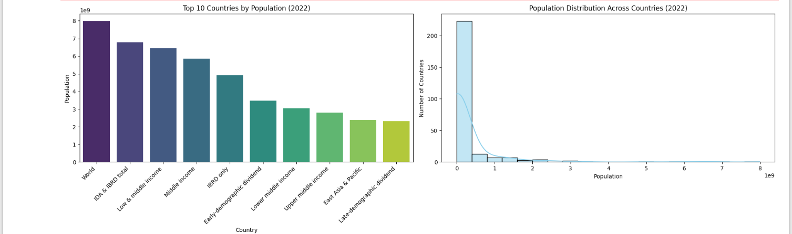

# Task 1 – Population Data Visualization

##About the Project
In this task, I worked with real population data from the World Bank to analyze and visualize how the population is distributed across different countries.  
The main goal was to find the most populated countries in 2022 and understand the overall population pattern using simple visualizations.

## Dataset Used
- https://www.canva.com/link?target=https%3A%2F%2Fgithub.com%2FProdigy-InfoTech%2Fdata-science-datasets%2Ftree%2Fmain%2FTask%25201&design=DAFpRxy47kU&utl=h61d045f407&accessRole=viewer&linkSource=document

## Tools and Libraries
This project was completed using:
- Python  
- Pandas for data handling  
- Seaborn and Matplotlib for visualization  

## What I Did
- Loaded the dataset and selected population data for the year 2022  
- Cleaned the data by removing missing values  
- Found the top 10 countries with the highest population  
- Created:
  - A bar chart showing the top 10 most populated countries  
  - A histogram showing how population is distributed across all countries  

## Output Visualizations
### Top 10 Countries by Population (2022)

### Population Distribution Across Countries (2022)

### Combined Visualization

## Files Included
- `Task1_Population_Analysis.ipynb` – Jupyter notebook with full code  
- `population_bar_chart.png` – Bar chart image  
- `population_histogram.png` – Histogram image  
- `population_charts_combined.png` – Combined visualization  

## Conclusion
This task helped me practice basic data cleaning and data visualization techniques.  
It gave me a clear understanding of how population data can be analyzed and presented in a meaningful way using Python.
