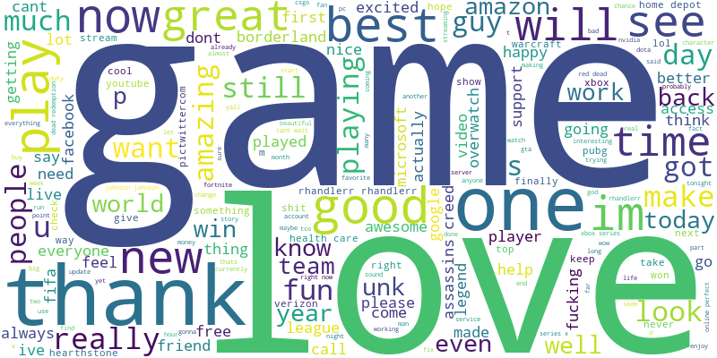

# Task 4 – Social Media Sentiment Analysis

## About the Project:
In this task, I analyzed social media data to understand public sentiment and opinions about different topics.  
The main goal was to clean the text, visualize sentiment patterns, and explore which topics had more positive or negative responses.

## Dataset Used:
- Dataset: Social Media Sentiment Dataset  
- Source: https://www.canva.com/link?target=https%3A%2F%2Fgithub.com%2FProdigy-InfoTech%2Fdata-science-datasets%2Ftree%2Fmain%2FTask%25204&design=DAFpRxy47kU&utl=h61d045f407&accessRole=viewer&linkSource=document

## Tools and Libraries:
- Python  
- Pandas and NumPy  
- Matplotlib and Seaborn  
- WordCloud  

## What I Did:

### Data Preprocessing
- Cleaned text data by removing special characters, URLs, and converting to lowercase  
- Prepared the dataset for visualization  

### Data Analysis and Visualization
- Visualized the overall sentiment distribution  
- Studied sentiment distribution across topics  
- Created a positive sentiment word cloud to highlight commonly used positive words  

## Output Visualizations

### 🙂 Overall Sentiment Distribution

### 📊 Topic-wise Sentiment Distribution

### 🌟 Positive Sentiment Word Cloud

## Files Included
- `Task4_SocialMedia_Sentiment.ipynb` – Jupyter notebook with preprocessing and visualizations  
- Output images of the visualizations shown above:  
  - `overall_sentiment_distribution.png`  
  - `topicwise_sentiment_distribution.png`  
  - `positive_wordcloud.png`  

---

## Conclusion
This task helped me understand how sentiment analysis can reveal insights from social media data.  
It also demonstrated the importance of text preprocessing and visualization techniques to analyze opinions and attitudes effectively.
